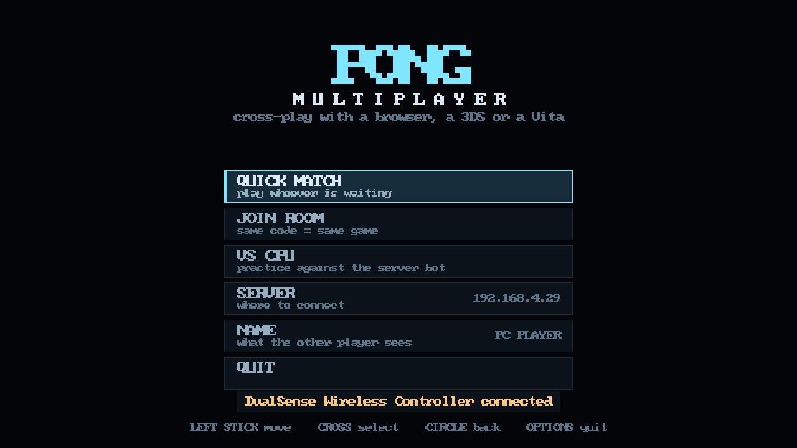
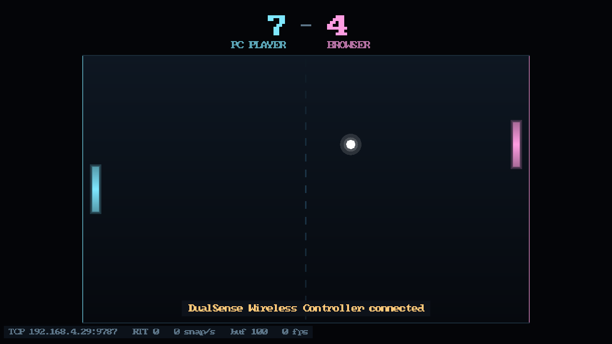
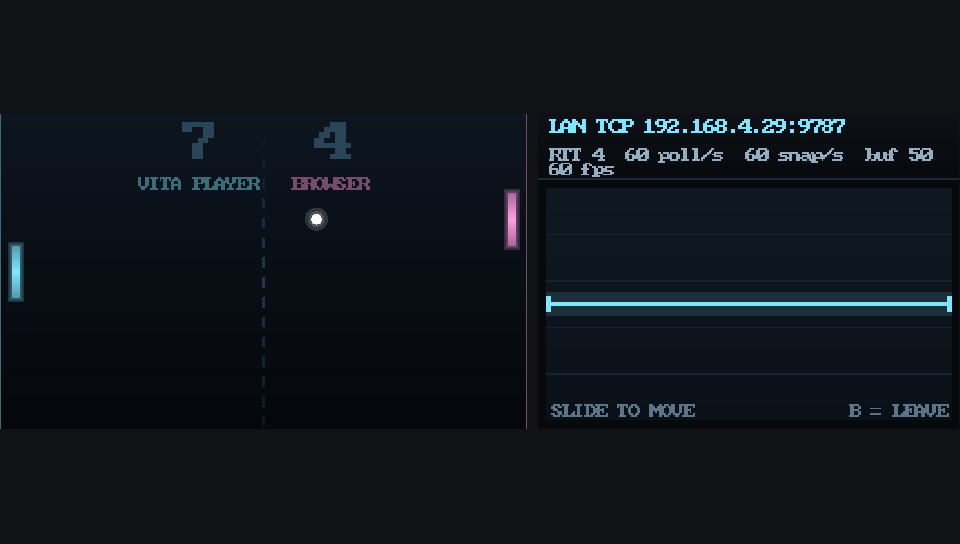
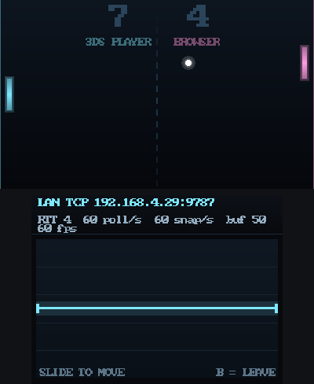
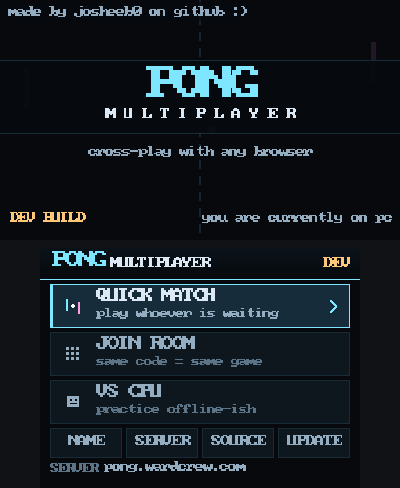

# Pong

Cross-play Pong across **six clients** — a Nintendo 3DS, a PS Vita, Windows,
macOS, Linux and a web browser — refereed by one authoritative server.

Every pairing has been played on real hardware.

|            | 3DS | Vita | Windows | macOS | Linux | Browser |
|------------|:---:|:----:|:-------:|:-----:|:-----:|:-------:|
| **3DS**    |  —  |  ✅  |   ✅    |  ✅   |  ✅   |   ✅    |
| **Vita**   | ✅  |  —   |   ✅    |  ✅   |  ✅   |   ✅    |
| **Windows**| ✅  |  ✅  |    —    |  ✅   |  ✅   |   ✅    |
| **macOS**  | ✅  |  ✅  |   ✅    |   —   |  ✅   |   ✅    |
| **Linux**  | ✅  |  ✅  |   ✅    |  ✅   |   —   |   ✅    |
| **Browser**| ✅  |  ✅  |   ✅    |  ✅   |  ✅   |    —    |

```
  browser        3DS              Vita           Windows / macOS / Linux
  React+MUI      C + citro2d      C + vita2d     C + SDL3
  WS/SSE/poll    TCP / HTTPS      TCP (SceNet)   TCP
       \             |                |                    /
        \____________ identical binary frames _____________/
                              |
                    Session (transport-agnostic)
                              |
                    Room -> 60Hz integer simulation
```

## What each client is

| | Interface | Transport | Text entry |
|---|---|---|---|
| **3DS** | two screens, 400x240 + 320x240 touch | raw TCP on a LAN, or HTTPS anywhere via its own mbedTLS | swkbd |
| **PS Vita** | one 960x544 screen, touch | raw TCP over SceNet | system IME |
| **Windows** | resizable window | raw TCP (Winsock) | SDL text input |
| **macOS** | resizable window | raw TCP | SDL text input |
| **Linux** | resizable window | raw TCP | SDL text input |
| **Browser** | responsive page | WebSocket -> SSE -> long-poll | the browser's |

Every client offers quick match, room codes, a CPU opponent, an editable server
address and a player name shown beside the score. The 3DS additionally updates
itself from GitHub Releases.

**The desktop and Vita builds speak raw TCP only**, so they play against a server
on your network. For play over the internet, the browser client and the 3DS both
do it properly — the 3DS carries its own TLS stack for exactly that reason.

## What it looks like

The same `src/ui/render.c` draws all three. Each platform supplies a renderer
backend behind `src/gfx/gfx.h` and nothing else changes.

### PC — SDL3, its own interface

The desktop build is **not the handheld one in a window**. One canvas, a
full-size playfield, a scoreboard above it and a proper menu -- the same
reasoning that gives the browser client its own interface. A window is not a
3DS, and making either pretend to be the other makes both worse.





Keyboard, mouse, or a gamepad -- SDL3 knows the DualSense natively, so a PS5
controller is plug-and-play and the on-screen hints switch to its button names
when one is attached. Both shots above were captured from the running build;
the second is a demo state, and the connected screen below is against a real
server.

### PS Vita — 960x544



### Nintendo 3DS — 400x240 over 320x240  *(handheld interface)*

| in a match | the menu |
|---|---|
|  |  |

**How these were made, and what they are not.** The PC shots are real captures
from the SDL3 build. The Vita and 3DS images are the *same build* rendering at
those layouts — honest about arrangement, scale and every pixel of the
interface, because the layout rule is shared between backends and the Vita
backend uses the same embedded font.

The one thing they do not show is the console's **typeface**: the 3DS backend
draws through citro2d with the system font, which is proportional, where the PC
and Vita backends use an embedded 8x8 bitmap face. So the 3DS images are a
faithful preview of layout and a stand-in for text. Photographs of real hardware
would be better and are welcome.

## Quick start

```bash
make dev
```

Server on `:8788` (HTTP + WebSocket) and `:8787` (raw TCP for the 3DS), web client
on `:5173`. Open two tabs and play. `make test` runs everything.

## Building for each platform

```bash
make dev          # server + web client, for development
make 3ds          # 3ds/pong3ds.3dsx and .cia   (devkitARM)
make -C pc        # pc/pong-pc                  (SDL3)
make -C vita      # vita/pong-vita.vpk          (VitaSDK)
make test         # everything below
```

CI builds all five native targets on every push and attaches them to a release
on a version tag. Nothing needs the others installed: the 3DS build does not
need SDL3, the desktop build does not need devkitPro.

`make -C pc run` opens a window.

| flag | |
|---|---|
| `--size WxH` | window size |
| `--autoplay` | join a quick match straight away |
| `--demo` | fill in a match state without a server, for screenshots |
| `--frames N --shot f.bmp` | render N frames, save one, exit |

The PC build reads `pong-pc.cfg` beside the binary (`server`, `port`, `name`),
and SERVER and NAME are editable in the menu. **It speaks raw TCP only**, so it
plays against a server on the LAN and not through the Cloudflare tunnel -- to
play over the internet from a desktop, open the web client, which already does
that properly.

**Status.** All five build in CI and all five have played against each other on
real hardware -- 3DS, macOS, Windows, Linux, PS Vita, plus the browser client.
Fifteen pairings, every one confirmed.

The Vita build was written without a VitaSDK to hand and debugged through CI and
crash dumps from the console. Four things were wrong and none of them were the
rendering: a container shell without `pipefail`, a stub library the SDK image
references but does not ship, an upstream `ceil()` with no `<math.h>`, and a
missing `-Wl,-q` -- without which the module loads unrelocated and faults before
`main()` runs. A forty-line test app is what finally separated the platform from
the game, and it should have been the first thing written rather than the last.

## The renderer seam

`src/gfx/gfx.h` is the whole platform surface: rectangles, a gradient, a circle,
text, and two logical screens. That is genuinely all Pong needs, and a small
seam is one that three backends can agree on.

| | |
|---|---|
| `src/gfx/3ds/` | citro2d. Nearly a direct mapping -- `PongColor` is the same packing as `C2D_Color32`, so colours are a cast |
| `src/gfx/sdl3/` | SDL3. Gradients via `RenderGeometry`, the ball as a triangle fan |
| `src/gfx/vita/` | vita2d. Gradients banded into strips, since it has no per-vertex colour |

**Two surfaces, always.** The interface is laid out in the 3DS's 400x240 and
320x240 and every backend presents both, deciding for itself where they go. The
console maps them to its two panels; the Vita and a PC window measure side-by-side
against stacked and pick whichever makes the playfield larger. The alternative --
one canvas with per-platform layout -- would put a branch for every target into
the UI code, which is the thing the seam exists to avoid.

**Text is an embedded 8x8 bitmap font** on SDL3 and the Vita rather than
SDL_ttf. It has to look the same in three places, and two font rasterisers do
not agree about metrics: a panel sized on one would clip on another. The 3DS
keeps its system font, which is why its text is proportional and the others'
is not.

## Layout

| Path | What |
|------|------|
| `shared/protocol.json` | **Single source of truth** for the wire protocol |
| `tools/gen-protocol.mjs` | Generates the TypeScript *and* C codecs plus golden test vectors |
| `shared/sim/paddle.ts` | Paddle motion, imported by the server and the web client, mirrored in C |
| `server/src/sim/pong.ts` | Pure, deterministic, integer-only simulation |
| `server/src/net/` | Sessions, dispatch, and the four transports |
| `web/src/net/ladder.ts` | Transport negotiation |
| `web/src/game/` | Interpolation, prediction, canvas renderer |
| `src/gfx/` | The renderer seam and its three backends |
| `src/ui/` | The interface, drawn through that seam by every platform |
| `pc/`, `vita/` | Per-platform front ends: window, input, clock |
| `3ds/source/` | The console client |
| `3ds/vendor/` | mbedTLS and the CIA tooling, fetched by script |

## Three ideas the design rests on

**One binary protocol on every transport.** An 8-byte length-prefixed header
makes a TCP stream and an HTTP body the same parsing problem, so there is exactly
one encoder and one decoder per language instead of a JSON path for the web and a
packed path for the console. `shared/protocol.json` generates both, and a host
test asserts the C codec reproduces the TypeScript encoder byte for byte — the
classic way a binary protocol rots is prevented by construction rather than by
discipline.

**Absolute paddle targets, never deltas.** Clients send *where the paddle should
be*, not *how far to move it*. A dropped absolute target costs nothing; the next
one is still correct. A dropped delta is a permanent desync. This single choice
is what makes a 10Hz polling client viable at all. The server then moves each
paddle toward its target under a speed clamp every tick — so a slow client's
paddle keeps gliding smoothly between its updates instead of stepping.

**Snapshot history, not just current state.** The server keeps one second of
per-tick snapshots. A client polling at 10Hz doesn't receive "the current
position" — it receives the newest state *plus the intermediate 30Hz sample
points it missed*, so its interpolator traces the ball's real path instead of a
straight chord across the curve. Measured: **10 polls/sec yields ~36
snapshots/sec.**

`docs/NETCODE.md` has the full reasoning; `docs/PROTOCOL.md` has the byte layouts.

## The 3DS client

### Why it bundles its own TLS

`pong.wardcrew.com` sits behind Cloudflare serving an **ECDSA P-256 certificate
with no RSA certificate available** — verified directly: RSA-auth cipher suites
are answered with `handshake_failure`. libctru's `httpc` delegates TLS to the
console's system SSL module, whose cipher list is fixed in firmware and may not
include the ECDHE-ECDSA suites required.

So the client links its own mbedTLS 3.6.2, built for ARM11 with a cipher set
chosen to match what the edge actually offers (`3ds/vendor/mbedtls_config_3ds.h`
explains each option). The handshake is then ours to debug rather than the
firmware's to refuse.

### Certificate verification

The app ships its own trust roots in `3ds/romfs/cacert.pem` (regenerate with
`3ds/vendor/fetch-cacerts.sh`), because the console has no usable CA store.

Verification is **on by default**, and deliberately not all-or-nothing. The real
3DS problem is that its clock is frequently wrong, which fails a certificate's
validity window even when the certificate is perfectly good — a clock problem,
not a security one. Disabling verification to dodge that throws away MITM
protection to fix a clock.

So the handshake uses `MBEDTLS_SSL_VERIFY_OPTIONAL` and then inspects *why*
verification failed, accepting only when the sole complaints are
`BADCERT_EXPIRED` / `BADCERT_FUTURE`. A bad chain, an unknown issuer or a
hostname mismatch remains fatal — an attacker cannot present a certificate they
have no valid chain for, whatever the console's clock says.

`web_verify=0` in the config turns it off for debugging a certificate problem.
With verification requested and no bundle present, the connection **fails**
rather than silently continuing unverified.

### Building

```bash
make 3ds        # builds 3ds/pong3ds.3dsx (fetches and builds mbedTLS first)
make cia        # builds 3ds/pong3ds.cia  (installs to the HOME menu via FBI)
make send N3DS_IP=192.168.4.x    # push over wifi, no SD card
```

`make send` is the development loop — `3dslink` delivers the build straight into
the Homebrew Launcher in about a second.

### Configuring without rebuilding

`3ds/romfs/config.txt` ships the defaults; `sdmc:/3ds/pong3ds.cfg` overrides any
of them. Changing servers never requires a rebuild.

### Updating itself

The menu's **SOURCE** row cycles through where the console looks for a newer
build: upstream `josheeb0`, the `johndoe6345789` fork, or the game server.

GitHub is the default because the server can only report the build *it* is
running, so a server that has not been redeployed hides a newer release
completely — a gap that is invisible from the console. Asking GitHub answers
"is there a newer build" regardless of what any server is doing.

`gh_owner`/`gh_repo` in the config name any repository. A target that matches no
preset is shown in full and is never silently overwritten by cycling.

This replaces the `.3dsx` on the SD card, applied at next launch. A `.cia`
cannot install another `.cia` without `am:u` access, which is FBI's job — when
running as an installed title the updater reports the build and the URL rather
than pretending to have updated itself.

## Testing

```bash
make test
```

| Test | Proves |
|------|--------|
| `server/test/matchmaker.test.ts` | Pairing is immediate, does not depend on timing, still prefers cross-play when there is a choice, and never pairs someone with a disconnected session |
| `3ds/test/test_interp.c` | The ball keeps moving when snapshots stop, stops predicting past its cap, stays inside the field, and absorbs corrections rather than snapping |
| `server/test/sim.test.ts` | Determinism over 1000 ticks, paddle clamping, no tunnelling, scoring, slow mode |
| `3ds/test/test_proto.c` | The C codec matches the TypeScript encoder byte for byte, rejects malformed frames, and reports NEED_MORE at every truncation point |
| `3ds/test/test_play.c` | **The actual 3DS netcode plays a real match** against a running server — compiled with host clang under ASan/UBSan, no console required |
| `server/tools/rrclient.ts` | The HTTP request/response path carries a live match, and reports the batching numbers |

The two C tests are the load-bearing ones: between them, the console code is
verified without hardware in the loop. `3ds/source/game/client.c` and
`pong_proto.c` deliberately have **no libctru dependency** so they compile
natively — which is also what keeps a future Wii client viable.

## CI and deploying

`.github/workflows/ci.yml` runs on every push and PR:

- protocol codegen has not drifted from `shared/protocol.json`
- server typecheck and simulation tests
- **the C codec test** — plain C99 with no libctru dependency, so CI can prove
  the console's wire format still matches the TypeScript encoder without a
  devkitARM toolchain
- web typecheck, build, and a gzipped bundle-size ceiling

On `main` it also:

- publishes `ghcr.io/johndoe6345789/pong3ds`, with the CI run number and commit
  baked in and reported at `/healthz`, so you can always tell which build is
  actually live
- **builds the 3DS client and publishes `.cia` + `.3dsx` to Releases**, one
  release per commit (`build-N`, marked pre-release). Version tags (`v*`) get a
  proper release instead.
- **copies that same console build into the server image**, so
  `/downloads/pong3ds.3dsx` always matches the `BUILD_ID` the server reports and
  the 3DS's in-app updater works straight from CI — no separate upload step, and
  no way for server and console builds to drift apart.

The 3DS job is split across two environments because neither can do the whole
job: the toolchain runs in the `devkitpro/devkitarm` container (installing the
SDK on the runner is not an option — `apt.devkitpro.org` answers 403 to
everything), while `.cia` packaging runs on the runner itself (that container is
Debian bookworm, glibc 2.36, and `makerom` links against 2.38). mbedTLS is
cached on its version and cipher config, since it is the slow part.

See `deploy/DEPLOY.md`. Short version: pull the image, publish 8788 (HTTP) and
8787 (raw TCP for the 3DS).

## Not built

**A Wii client.** The protocol reserves `platform = 3` for it and always has.
After the Vita, the shape of that job is known precisely: a renderer backend
behind `src/gfx/gfx.h` and a socket layer. No protocol change, no simulation
change, and the interface already exists in two forms to pick from.

**In-app updates anywhere but the 3DS.** The console fetches its own `.3dsx`
from GitHub Releases; every other platform is installed by hand.
